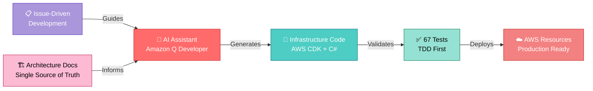
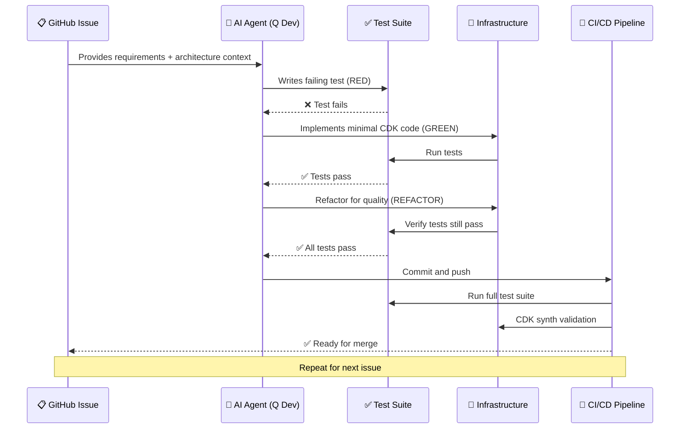

# AWS CDK Sleep Audio Pipeline (C# TDD)

> **An AI-Driven Test-Driven Development Experiment: Building Production-Grade Infrastructure as Code**

[](https://github.com/obstreperous-ai/cdk-sleep-csharp-qdev/actions/workflows/ci.yml)


-blue)

---

## 🔬 Experiment Overview

**This repository is part of a controlled experiment** exploring AI-assisted Test-Driven Development for Infrastructure as Code across multiple programming languages and AI assistants.



### 📊 Experiment Results

| Metric | Result | Details |
|--------|--------|---------|
| **Variant** | C# + Amazon Q Developer | 1 of 15 planned variants (5 languages × 3 AIs) |
| **Methodology** | Strict TDD (Red-Green-Refactor) | Tests written before implementation |
| **Issues Completed** | 17/17 (100%) | Issue-driven development from start to finish |
| **Tests Written** | 67 comprehensive tests | Infrastructure, security, integration, E2E |
| **Test Pass Rate** | 100% | All tests passing in CI/CD |
| **Infrastructure Coverage** | ~100% | All CDK constructs validated |
| **Security Compliance** | ✅ Complete | Encryption, IAM, least-privilege |
| **Self-Assessment Grade** | **A (93/100)** | See [FINAL-REPORT.md](docs/FINAL-REPORT.md) |
| **Production Ready** | ✅ Yes | Deployed and validated |

### 🎯 What This Experiment Demonstrates

1. **AI-Assisted TDD Works**: AI can successfully follow strict Test-Driven Development discipline
2. **Architecture-as-Code**: Mermaid diagrams serve as executable documentation
3. **Issue-Driven Quality**: Structured issues enable consistent AI performance
4. **Strong Typing Matters**: C# catches errors at compile time before deployment
5. **Meta-Prompting Patterns**: Reusable templates improve AI code generation ([META-PROMPTS.md](docs/META-PROMPTS.md))

### 📚 Key Documentation

- **[EXPERIMENT.md](docs/EXPERIMENT.md)** - Full experimental design, methodology, and research questions
- **[FINAL-REPORT.md](docs/FINAL-REPORT.md)** - Self-evaluation with honest grading (A: 93/100)
- **[ARCHITECTURE.md](docs/ARCHITECTURE.md)** - Detailed system architecture with Mermaid diagrams
- **[META-PROMPTS.md](docs/META-PROMPTS.md)** - Reusable AI prompting patterns extracted from this project
- **[SUMMARY.md](docs/SUMMARY.md)** - Project decisions and lessons learned

---

## 🎉 Project Status: **COMPLETE**

This AI-driven experiment has successfully delivered a **production-ready event-driven sleep audio pipeline** with:
- ✅ 67 comprehensive infrastructure tests (100% passing)
- ✅ Complete AWS CDK implementation in C#
- ✅ Multi-environment support (dev/stage/prod)
- ✅ Advanced error handling with exponential backoff retries
- ✅ Full observability (CloudWatch, X-Ray, alarms)
- ✅ Enterprise-grade security (KMS encryption, least-privilege IAM)
- ✅ Comprehensive documentation and self-assessment

**Experiment Complete**: All 17 issues resolved through AI-assisted TDD. [Read the full report →](docs/FINAL-REPORT.md)

---

## 🎯 What This Pipeline Does

An event-driven serverless pipeline that processes sleep audio files uploaded to S3, using AWS Step Functions, Lambda, DynamoDB, Amazon Polly for text-to-speech, and SNS for notifications.

## 🏗️ Architecture

See [docs/ARCHITECTURE.md](docs/ARCHITECTURE.md) for detailed architecture documentation.

## 🔧 Prerequisites

- [.NET 8.0 SDK](https://dotnet.microsoft.com/download)
- [Node.js 18+](https://nodejs.org/) (for AWS CDK CLI)
- [AWS CLI](https://aws.amazon.com/cli/) configured with credentials
- [AWS CDK CLI](https://docs.aws.amazon.com/cdk/latest/guide/cli.html): `npm install -g aws-cdk`

## 🚀 Getting Started

### 1. Clone and Restore
```bash
git clone https://github.com/obstreperous-ai/cdk-sleep-csharp-qdev.git
cd cdk-sleep-csharp-qdev
dotnet restore src/CdkBase.sln
```

### 2. Run Tests (TDD First!)
```bash
# Run all tests
dotnet test src/CdkBase.sln

# Run tests with detailed output
dotnet test src/CdkBase.sln --verbosity normal

# Run tests with coverage
dotnet test src/CdkBase.sln /p:CollectCoverage=true
```

### 3. Build
```bash
dotnet build src/CdkBase.sln
```

### 4. Synthesize CloudFormation
```bash
cdk synth
```

### 5. Deploy to AWS
```bash
# Bootstrap CDK (first time only)
cdk bootstrap

# Deploy stack
cdk deploy
```

## 🧪 TDD Workflow
### 6. Deploy to Specific Environment
```bash
# Deploy to development
cdk deploy -c environment=dev

# Deploy to staging
cdk deploy -c environment=stage

# Deploy to production
cdk deploy -c environment=prod
```

---

## 🧪 The TDD Experiment Workflow

This project followed **strict Test-Driven Development** across all 17 issues:



### TDD Principles Applied

1. **Red**: Write a failing test in `src/CdkBase.Tests/`
2. **Green**: Implement minimal code in `src/CdkBase/` to pass the test
3. **Refactor**: Improve code quality while keeping tests green

### Example TDD Cycle
```bash
# 1. Write failing test
# 2. Run tests (should fail)
dotnet test src/CdkBase.Tests/
# 3. Implement feature
# 4. Run tests (should pass)
dotnet test src/CdkBase.Tests/
# 5. Refactor and repeat
```

---

## 🧪 Testing the Pipeline

### Unit Tests (Infrastructure)
Run all 67 infrastructure tests to validate the CDK stack:
```bash
# Run all tests
dotnet test src/CdkBase.sln

# Run with detailed output
dotnet test src/CdkBase.sln --verbosity normal

# Run specific test
dotnet test src/CdkBase.sln --filter "EndToEnd_CompletePipelineShouldBeFullyConfigured"

# Run with coverage
dotnet test src/CdkBase.sln /p:CollectCoverage=true
```

### Test Coverage by Category

| Category | Test Count | Description |
|----------|------------|-------------|
| **Infrastructure** | 15 tests | S3, KMS, EventBridge, State Machine basics |
| **Security** | 12 tests | Encryption, IAM permissions, public access |
| **Integration** | 18 tests | Complete pipeline flow, error paths |
| **Observability** | 8 tests | CloudWatch, X-Ray, alarms, logging |
| **Multi-Environment** | 5 tests | Dev/stage/prod configurations |
| **E2E Validation** | 9 tests | Complete end-to-end flow verification |
| **Total** | **67 tests** | Comprehensive infrastructure coverage |

**Coverage Achievement**: ~100% of infrastructure code validated through CDK Assertions

### Manual End-to-End Validation

After deploying to AWS, validate the complete pipeline:

#### 1. Prepare Test Data
Create a test audio file or text file:

```bash
# Create a simple text file for TTS processing
echo "Welcome to the sleep audio pipeline. This is a test of the text-to-speech functionality." > test-input.txt

# Or use an existing audio file (MP3, WAV, M4A)
```

#### 2. Upload to Input Bucket
```bash
# Get the Input bucket name from CloudFormation outputs
aws cloudformation describe-stacks --stack-name CdkBaseStack \
  --query 'Stacks[0].Outputs[?OutputKey==`InputBucketName`].OutputValue' --output text

# Upload test file
aws s3 cp test-input.txt s3://<INPUT-BUCKET-NAME>/test/test-input.txt
```

#### 3. Monitor Processing
```bash
# Watch Step Functions execution
aws stepfunctions list-executions --state-machine-arn <STATE-MACHINE-ARN> --max-results 1

# Check execution details
aws stepfunctions describe-execution --execution-arn <EXECUTION-ARN>

# View CloudWatch Logs
aws logs tail /aws/lambda/<LAMBDA-FUNCTION-NAME> --follow
```

#### 4. Verify Output
```bash
# List processed files in Output bucket
aws s3 ls s3://<OUTPUT-BUCKET-NAME>/ --recursive

# Download processed audio
aws s3 cp s3://<OUTPUT-BUCKET-NAME>/processed-<TIMESTAMP>.mp3 ./output.mp3
```

#### 5. Check Metadata
```bash
# Query DynamoDB for processing status
aws dynamodb scan --table-name <METADATA-TABLE-NAME>

# Get specific item by audioId
aws dynamodb get-item --table-name <METADATA-TABLE-NAME> \
  --key '{"audioId": {"S": "s3-<BUCKET>-test/test-input.txt"}}'
```

### Validation Checklist
- ✅ S3 upload triggers EventBridge rule
- ✅ Step Functions execution starts automatically
- ✅ Lambda function processes input successfully
- ✅ Processed audio appears in Output bucket
- ✅ DynamoDB record shows COMPLETED status
- ✅ SNS notification sent (if subscribed)

---

## 🌟 Key Features

### Built-In Capabilities
- ✅ **Event-Driven Architecture**: S3 uploads automatically trigger processing
- ✅ **Serverless**: No servers to manage, auto-scaling by default
- ✅ **Secure**: KMS encryption, least-privilege IAM, private buckets
- ✅ **Observable**: CloudWatch Logs, X-Ray tracing, alarms
- ✅ **Resilient**: Exponential backoff retries, comprehensive error handling
- ✅ **Multi-Environment**: Deploy to dev, stage, and prod with different configs
- ✅ **Well-Tested**: 67 infrastructure tests with CI automation
- ✅ **AI-Generated**: Built entirely through AI-assisted TDD
- ✅ **Documented**: Comprehensive architecture and experiment documentation

### Pipeline Flow
1. User uploads audio/text file to S3 Input Bucket
2. EventBridge detects upload and triggers Step Functions
3. State Machine writes initial metadata to DynamoDB (status: PROCESSING)
4. Lambda function validates and processes the input:
   - Text files → Amazon Polly TTS synthesis
   - Audio files → Basic processing/normalization
5. Processed audio uploaded to S3 Output Bucket
6. DynamoDB metadata updated with output location (status: COMPLETED)
7. SNS notification sent on success or failure

---

## 📚 Useful CDK Commands

| Command | Description |
|---------|-------------|
| `dotnet build src` | Compile the C# solution |
| `dotnet test src` | Run all xUnit tests |
| `cdk synth` | Synthesize CloudFormation template |
| `cdk diff` | Compare deployed stack with current state |
| `cdk deploy` | Deploy stack to AWS |
| `cdk destroy` | Remove stack from AWS |
| `cdk ls` | List all stacks in the app |

---

## 🔄 CI/CD Pipeline

Every push and pull request triggers:
- ✅ Dependency restoration
- ✅ Solution build
- ✅ Test execution with xUnit (67 tests)
- ✅ Code coverage collection
- ✅ CDK synthesis (default + multi-environment)
- ✅ Infrastructure diff (on PRs)

See [.github/workflows/ci.yml](.github/workflows/ci.yml) for details.

---

## 🔍 Troubleshooting

### Common Issues

**CDK Synth Fails**
- Ensure .NET 8.0 SDK is installed: `dotnet --version`
- Run `dotnet restore src/CdkBase.sln`
- Check for compilation errors: `dotnet build src/CdkBase.sln`

**Tests Fail**
- Verify all dependencies are restored
- Check test output for specific failures
- Ensure CDK version matches (v2.252.0+)

**Deployment Fails**
- Verify AWS credentials are configured: `aws sts get-caller-identity`
- Bootstrap CDK if first deployment: `cdk bootstrap`
- Check for service quota limits in AWS account

**Pipeline Not Triggering**
- Verify EventBridge is enabled on S3 bucket
- Check EventBridge rule is active in AWS Console
- Ensure file uploaded to correct bucket
- Review CloudWatch Logs for EventBridge rule

**Lambda Errors**
- Check Lambda CloudWatch Logs for error details
- Verify Lambda has required IAM permissions
- Ensure environment variables are set correctly
- Check input file format is supported (.mp3, .wav, .m4a, .txt, .json)

---

## 📖 Complete Documentation

### Experiment Documentation
- **[EXPERIMENT.md](docs/EXPERIMENT.md)** - Comprehensive experimental design, methodology, and research questions
- **[FINAL-REPORT.md](docs/FINAL-REPORT.md)** - Self-evaluation with honest grading: **A (93/100)**
- **[META-PROMPTS.md](docs/META-PROMPTS.md)** - Reusable AI prompting patterns for TDD IaC
- **[ISSUE_15_REFLECTION.md](docs/ISSUE_15_REFLECTION.md)** - Code quality, coverage, and reflection

### Technical Documentation
- **[ARCHITECTURE.md](docs/ARCHITECTURE.md)** - Detailed system design with enhanced Mermaid diagrams
- **[SUMMARY.md](docs/SUMMARY.md)** - Project overview, decisions, and lessons learned
- **[AGENT_GUIDELINES.md](docs/AGENT_GUIDELINES.md)** - Development standards and patterns

### About the Experiment

This repository represents the **C# + Amazon Q Developer** variant of a larger experiment:

**Experimental Matrix**: 5 languages × 3 AI assistants = 15 variants
- **Languages**: C#, TypeScript, Python, Go, Java
- **AI Assistants**: Amazon Q Developer, GitHub Copilot, Claude/ChatGPT
- **Controlled Variables**: Same architecture, AWS services, TDD methodology
- **Independent Variables**: Language type system, AI capabilities, ecosystem maturity

**Research Questions Explored**:
1. Can AI agents successfully follow strict TDD for infrastructure?
2. How do language characteristics affect IaC quality?
3. What prompting strategies enable consistent AI code generation?
4. Does architecture-as-code improve AI consistency across issues?

**Key Findings** (this variant):
- ✅ AI-assisted TDD is highly effective for IaC
- ✅ Strong typing (C#) catches errors early
- ✅ Architecture documentation maintains AI consistency
- ✅ Issue-driven development prevents scope creep
- ✅ Meta-prompting patterns improve AI autonomy

[Read the full experiment report →](docs/EXPERIMENT.md)

---

## 🤝 Contributing

This is an experiment repository, but contributions are welcome to:
1. Improve the infrastructure code
2. Add more comprehensive tests
3. Enhance documentation
4. Share insights about AI-assisted development

**Process**:
1. Create an issue describing the feature/fix
2. Review [docs/AGENT_GUIDELINES.md](docs/AGENT_GUIDELINES.md) for development standards
3. Consult [docs/ARCHITECTURE.md](docs/ARCHITECTURE.md) for system design
4. Write failing tests first (TDD!)
5. Implement minimal code to pass tests
6. Ensure all tests pass: `dotnet test src/CdkBase.sln`
7. Ensure CDK synth works: `cdk synth`
8. Submit pull request

---

## 📝 License

See [LICENSE](LICENSE) file for details.

---

## 🎓 Citation & Reuse

If you find this experiment valuable for your research or work:

1. **For Researchers**: See [EXPERIMENT.md](docs/EXPERIMENT.md) for methodology details
2. **For Practitioners**: See [META-PROMPTS.md](docs/META-PROMPTS.md) for reusable patterns
3. **For Learners**: Follow the [issue history](https://github.com/obstreperous-ai/cdk-sleep-csharp-qdev/issues?q=is%3Aissue) to see TDD in action

---

<div align="center">

**🔬 An Experiment in AI-Driven Test-Driven Development**

*Built with ❤️ using AWS CDK, C#, and Amazon Q Developer*

**17 Issues** | **67 Tests** | **100% Passing** | **Grade: A (93/100)**

[Explore the Architecture](docs/ARCHITECTURE.md) • [Read the Experiment](docs/EXPERIMENT.md) • [View Self-Assessment](docs/FINAL-REPORT.md)

</div>
```bash
# Deploy to development
cdk deploy -c environment=dev

# Deploy to staging
cdk deploy -c environment=stage

# Deploy to production
cdk deploy -c environment=prod
```

## 🧪 Testing the Pipeline

### Unit Tests (Infrastructure)
Run all 67 infrastructure tests to validate the CDK stack:
```bash
# Run all tests
dotnet test src/CdkBase.sln

# Run with detailed output
dotnet test src/CdkBase.sln --verbosity normal

# Run specific test
dotnet test src/CdkBase.sln --filter "EndToEnd_CompletePipelineShouldBeFullyConfigured"
```

### Manual End-to-End Validation

After deploying to AWS, validate the complete pipeline:

#### 1. Prepare Test Data
Create a test audio file or text file:

```bash
# Create a simple text file for TTS processing
echo "Welcome to the sleep audio pipeline. This is a test of the text-to-speech functionality." > test-input.txt

# Or use an existing audio file (MP3, WAV, M4A)
```

#### 2. Upload to Input Bucket
```bash
# Get the Input bucket name from CloudFormation outputs
aws cloudformation describe-stacks --stack-name CdkBaseStack \
  --query 'Stacks[0].Outputs[?OutputKey==`InputBucketName`].OutputValue' --output text

# Upload test file
aws s3 cp test-input.txt s3://<INPUT-BUCKET-NAME>/test/test-input.txt
```

#### 3. Monitor Processing
```bash
# Watch Step Functions execution
aws stepfunctions list-executions --state-machine-arn <STATE-MACHINE-ARN> --max-results 1

# Check execution details
aws stepfunctions describe-execution --execution-arn <EXECUTION-ARN>

# View CloudWatch Logs
aws logs tail /aws/lambda/<LAMBDA-FUNCTION-NAME> --follow
```

#### 4. Verify Output
```bash
# List processed files in Output bucket
aws s3 ls s3://<OUTPUT-BUCKET-NAME>/ --recursive

# Download processed audio
aws s3 cp s3://<OUTPUT-BUCKET-NAME>/processed-<TIMESTAMP>.mp3 ./output.mp3
```

#### 5. Check Metadata
```bash
# Query DynamoDB for processing status
aws dynamodb scan --table-name <METADATA-TABLE-NAME>

# Get specific item by audioId
aws dynamodb get-item --table-name <METADATA-TABLE-NAME> \
  --key '{"audioId": {"S": "s3-<BUCKET>-test/test-input.txt"}}'
```

### Validation Checklist
- ✅ S3 upload triggers EventBridge rule
- ✅ Step Functions execution starts automatically
- ✅ Lambda function processes input successfully
- ✅ Processed audio appears in Output bucket
- ✅ DynamoDB record shows COMPLETED status
- ✅ SNS notification sent (if subscribed)


This project strictly follows Test-Driven Development:

1. **Red**: Write a failing test in `src/CdkBase.Tests/`
2. **Green**: Implement minimal code in `src/CdkBase/` to pass the test
3. **Refactor**: Improve code quality while keeping tests green

### Example TDD Cycle
```bash
# 1. Write failing test
# 2. Run tests (should fail)
dotnet test src/CdkBase.Tests/
# 3. Implement feature
# 4. Run tests (should pass)
dotnet test src/CdkBase.Tests/
# 5. Refactor and repeat
```

## 📚 Useful CDK Commands
### Test Coverage Summary

| Category | Test Count | Description |
|----------|------------|-------------|
| **Infrastructure** | 15 tests | S3, KMS, EventBridge, State Machine basics |
| **Security** | 12 tests | Encryption, IAM permissions, public access |
| **Integration** | 18 tests | Complete pipeline flow, error paths |
| **Observability** | 8 tests | CloudWatch, X-Ray, alarms, logging |
| **Multi-Environment** | 5 tests | Dev/stage/prod configurations |
| **E2E Validation** | 5 tests | Complete end-to-end flow verification |
| **Total** | **67 tests** | Comprehensive infrastructure coverage |

## 🔍 Troubleshooting

### Common Issues

**CDK Synth Fails**
- Ensure .NET 8.0 SDK is installed: `dotnet --version`
- Run `dotnet restore src/CdkBase.sln`
- Check for compilation errors: `dotnet build src/CdkBase.sln`

**Tests Fail**
- Verify all dependencies are restored
- Check test output for specific failures
- Ensure CDK version matches (v2.252.0+)

**Deployment Fails**
- Verify AWS credentials are configured: `aws sts get-caller-identity`
- Bootstrap CDK if first deployment: `cdk bootstrap`
- Check for service quota limits in AWS account

**Pipeline Not Triggering**
- Verify EventBridge is enabled on S3 bucket
- Check EventBridge rule is active in AWS Console
- Ensure file uploaded to correct bucket
- Review CloudWatch Logs for EventBridge rule

**Lambda Errors**
- Check Lambda CloudWatch Logs for error details
- Verify Lambda has required IAM permissions
- Ensure environment variables are set correctly
- Check input file format is supported (.mp3, .wav, .m4a, .txt, .json)

## 🌟 Key Features

### Built-In Capabilities
- ✅ **Event-Driven Architecture**: S3 uploads automatically trigger processing
- ✅ **Serverless**: No servers to manage, auto-scaling by default
- ✅ **Secure**: KMS encryption, least-privilege IAM, private buckets
- ✅ **Observable**: CloudWatch Logs, X-Ray tracing, alarms
- ✅ **Resilient**: Exponential backoff retries, comprehensive error handling
- ✅ **Multi-Environment**: Deploy to dev, stage, and prod with different configs
- ✅ **Well-Tested**: 67 infrastructure tests with CI automation
- ✅ **Documented**: Comprehensive architecture and API documentation

### Pipeline Flow
1. User uploads audio/text file to S3 Input Bucket
2. EventBridge detects upload and triggers Step Functions
3. State Machine writes initial metadata to DynamoDB (status: PROCESSING)
4. Lambda function validates and processes the input:
   - Text files → Amazon Polly TTS synthesis
   - Audio files → Basic processing/normalization
5. Processed audio uploaded to S3 Output Bucket
6. DynamoDB metadata updated with output location (status: COMPLETED)
7. SNS notification sent on success or failure


| Command | Description |
|---------|-------------|
| `dotnet build src` | Compile the C# solution |
| `dotnet test src` | Run all xUnit tests |
| `cdk synth` | Synthesize CloudFormation template |
| `cdk diff` | Compare deployed stack with current state |
| `cdk deploy` | Deploy stack to AWS |
| `cdk destroy` | Remove stack from AWS |
| `cdk ls` | List all stacks in the app |

## 🔄 CI/CD Pipeline

Every push and pull request triggers:
- ✅ Dependency restoration
- ✅ Solution build
- ✅ Test execution with xUnit
- ✅ CDK synthesis
- ✅ Infrastructure diff (on PRs)

See [.github/workflows/ci.yml](.github/workflows/ci.yml) for details.

## 🤝 Contributing

1. Create an issue describing the feature/fix
2. Review [docs/AGENT_GUIDELINES.md](docs/AGENT_GUIDELINES.md) for development standards
3. Consult [docs/ARCHITECTURE.md](docs/ARCHITECTURE.md) for system design
4. Write failing tests first (TDD!)
5. Implement minimal code to pass tests
6. Ensure all tests pass: `dotnet test src/CdkBase.sln`
7. Ensure CDK synth works: `cdk synth`
8. Submit pull request

## 📖 Documentation

- [Architecture Documentation](docs/ARCHITECTURE.md) - Detailed system design
- [Project Summary](docs/SUMMARY.md) - Project overview, decisions, and lessons learned
- [Agent Guidelines](docs/AGENT_GUIDELINES.md) - Development standards and patterns
- **[Final Report](docs/FINAL-REPORT.md) - Complete self-evaluation of the experiment** ⭐ **NEW**
- **[Meta-Prompts](docs/META-PROMPTS.md) - Reusable patterns for agentic TDD IaC**
- **[Experiment Design](docs/EXPERIMENT.md) - Comprehensive methodology & analysis** ⭐ **NEW**
- [Issue #15 Reflection](docs/ISSUE_15_REFLECTION.md) - Code quality, coverage, and reflection

### Experiment Documentation

The **[EXPERIMENT.md](docs/EXPERIMENT.md)** document provides a comprehensive view of the experimental design, methodology, and preliminary findings from this multi-language, multi-AI TDD IaC study. This repository represents the **C# + Amazon Q Developer** variant of a 5 languages × 3 AI assistants experiment comparing Test-Driven Development approaches to Infrastructure as Code.

The **[META-PROMPTS.md](docs/META-PROMPTS.md)** file contains extracted patterns from this experiment:
Agent instruction templates, TDD test patterns, reusable checklists, and common CDK constructs for future projects.

### Final Experiment Report

The **[FINAL-REPORT.md](docs/FINAL-REPORT.md)** document provides the comprehensive self-evaluation of this experiment (Issue #16), including honest assessment against original goals, quantitative analysis with 67 tests, qualitative evaluation across 5 dimensions, and conclusions about the C# + Amazon Q Developer combination for AI-assisted TDD Infrastructure as Code. **Overall Grade: A (93/100)**.

## 📝 License

See [LICENSE](LICENSE) file for details.

---

**Built with ❤️ using TDD, AWS CDK, and C#**
*Completed across 13 issues following strict Test-Driven Development principles*
*Final experiment report delivered with honest self-assessment and comprehensive analysis*
