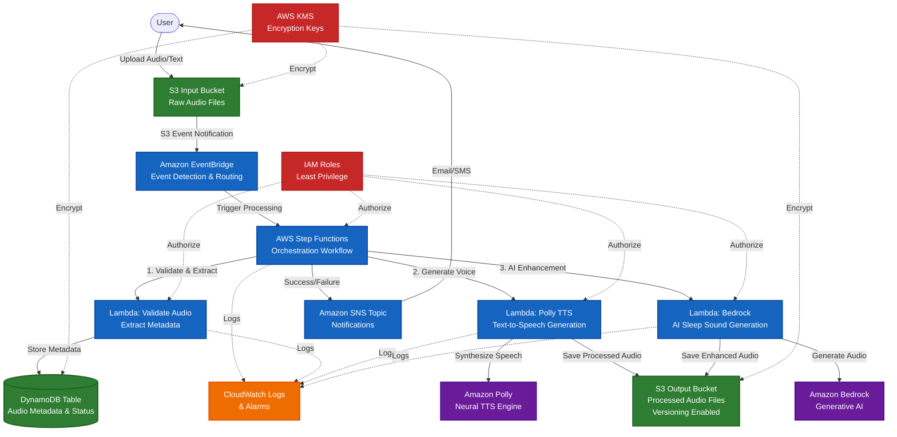

# Event-Driven Sleep Audio Pipeline Architecture

## Overview

This project implements a production-grade, event-driven sleep audio processing pipeline using AWS CDK with C# and follows Test-Driven Development (TDD) principles. The system enables users to upload raw audio files (voice recordings, ambient sounds, or text-to-speech requests) and automatically processes them through a serverless pipeline that generates soothing sleep audio content.

### Key Capabilities
- **Automated Audio Processing**: Event-driven architecture triggers processing on file upload
- **AI-Enhanced Audio**: Leverages Amazon Polly for text-to-speech and Bedrock for AI-generated soundscapes
- **Scalable & Reliable**: Serverless architecture scales automatically with demand
- **Observable**: Comprehensive logging and monitoring via CloudWatch
- **Secure**: Least-privilege IAM roles, encryption at rest, private S3 buckets
- **Multi-Environment**: Supports dev, stage, and prod environments via CDK context

---

## System Architecture Diagram
## Current Implementation Status

### ✅ Completed (Issue #3)
### ✅ Completed (Issues #3 and #4)
- **Output S3 Bucket**: Private bucket with KMS encryption and versioning for processed audio files
- **KMS Key**: Customer-managed key for S3 bucket encryption with automatic key rotation
- **EventBridge Rule**: Triggers on `Object Created` events from the Input bucket with CloudWatch Logs target
- **EventBridge Rule**: Triggers on `Object Created` events from the Input bucket, targets Step Functions state machine
- **Step Functions State Machine**: Orchestrates audio processing pipeline with CloudWatch logging enabled
- **Amazon Polly Integration**: Task state configured for text-to-speech synthesis (placeholder parameters)
### 🚧 Upcoming (Future Issues)
### 🚧 Upcoming (Issue #5 and Beyond)
- Lambda functions for validation and Bedrock enhancement
- SNS topic for notifications
- CloudWatch alarms and dashboards

These foundational components enable the event-driven architecture while following strict TDD principles with comprehensive test coverage.

---




---

## Core Infrastructure Components (Implemented)

### KMS Encryption Key
**Resource**: `AWS::KMS::Key`

A customer-managed KMS key provides encryption for all S3 buckets in the pipeline. This approach offers:
- **Key Rotation**: Automatic annual key rotation enabled
- **Audit Trail**: All key usage logged via CloudTrail
- **Fine-grained Access Control**: IAM policies control who can use the key
- **Compliance**: Meets data-at-rest encryption requirements

### Input S3 Bucket (`SleepAudioInputBucket`)
**Resource**: `AWS::S3::Bucket`

This bucket serves as the entry point for the audio processing pipeline:

**Security Features**:
- **Encryption**: KMS encryption with customer-managed key
- **Public Access**: Completely blocked (all four public access settings enabled)
- **SSL/TLS**: EnforceSSL bucket policy requires HTTPS for all operations
- **Versioning**: Enabled to protect against accidental deletions

**Event Configuration**:
- **EventBridge**: Enabled to emit S3 events to EventBridge for flexible event routing
- **Event Types**: All Object Created events (`PutObject`, `PostObject`, `CopyObject`, `CompleteMultipartUpload`)

### Output S3 Bucket (`SleepAudioOutputBucket`)
**Resource**: `AWS::S3::Bucket`

Stores processed audio files with the same security posture as the input bucket:
- KMS encryption, versioning, public access blocking, and SSL enforcement
- Ready to store outputs from Lambda processing functions

### EventBridge Rule (`S3ObjectCreatedRule`)
**Resource**: `AWS::Events::Rule`

Captures S3 Object Created events and routes them to processing targets:
- **Event Pattern**: Matches `aws.s3` source with `Object Created` detail type
- **Bucket Filter**: Only triggers for events from the Input bucket
- **Current Target**: CloudWatch Log Group (placeholder for future Step Functions or Lambda targets)
- **Targets**: Step Functions state machine (primary) and CloudWatch Log Group (for debugging)
This rule serves as the foundation for the event-driven pipeline, decoupling event detection from processing logic.

## Data Flow

### 1. Audio Upload & Event Detection
**Trigger**: User uploads a raw audio file (e.g., `user123/voice-recording.mp3`) or text file (e.g., `user123/bedtime-story.txt`) to the **Input S3 Bucket**.

**Event Flow**:
1. S3 emits an `s3:ObjectCreated:*` event notification
2. EventBridge rule matches the event pattern for the input bucket
3. EventBridge triggers the Step Functions state machine, passing object metadata (bucket name, object key, size, timestamp)

### 2. Processing Orchestration (Step Functions)
**State Machine Workflow**:

```
┌─────────────────┐
│  Start          │
└────────┬────────┘
         │
         ▼
┌─────────────────────────┐
│ Validate & Extract      │  ← Lambda: Check file type, extract metadata
│ Metadata                │    Store initial record in DynamoDB
└────────┬────────────────┘
         │
         ▼
    ┌────────┐
    │ Choice │  ← Branch based on input type
    └───┬────┘
        │
        ├─────► Text Input? ──► Polly TTS Generation ──┐
        │                                              │
        └─────► Audio Input? ──► Bedrock Enhancement ──┤
                                                       │
                                                       ▼
                                            ┌─────────────────┐
                                            │ Update DynamoDB │
                                            │ (Success Status)│
                                            └────────┬────────┘
                                                     │
                                                     ▼
                                            ┌─────────────────┐
                                            │ Send SNS        │
                                            │ Notification    │
                                            └────────┬────────┘
                                                     │
                                                     ▼
                                                  [End]

[Any Step Error] ──► Error Handler ──► Update DynamoDB (Failed Status) ──► SNS Error Notification ──► [End]
```

### 3. Processing Steps

#### Step 1: Validation & Metadata Extraction
- **Lambda Function**: `ValidateAudioFunction`
- **Actions**:
  - Validates file format (MP3, WAV, M4A, or TXT)
  - Extracts metadata: file size, duration (for audio), MIME type
  - Generates unique processing ID
  - Creates initial DynamoDB record:
    ```json
    {
      "ProcessingId": "proc-abc123",
      "UserId": "user123",
      "InputKey": "user123/voice-recording.mp3",
      "Status": "PROCESSING",
      "CreatedAt": "2024-01-15T10:30:00Z",
      "Duration": 120.5,
      "FileSize": 2048576
    }
    ```

#### Step 2: Text-to-Speech (Polly)
- **Lambda Function**: `PollyProcessingFunction`
- **Triggered When**: Input file is text (`.txt`, `.json` with text field)
- **Actions**:
  - Reads text content from input file
  - Invokes Amazon Polly with neural voice (e.g., `Joanna`, `Matthew`)
  - Applies SSML tags for soothing speech patterns (slower rate, softer volume)
  - Saves synthesized audio to Output S3 Bucket
  - Updates DynamoDB with output location and audio duration

**Example Polly Request**:
```xml
<speak>
  <prosody rate="slow" volume="soft">
    Close your eyes and imagine a peaceful forest...
  </prosody>
</speak>
```

#### Step 3: AI Enhancement (Bedrock)
- **Lambda Function**: `BedrockEnhancementFunction`
- **Triggered When**: Input file is audio or TTS output requires enhancement
- **Actions**:
  - Analyzes audio characteristics
  - Generates complementary ambient soundscapes (rain, ocean waves, white noise)
  - Mixes generated sounds with original audio
  - Applies sleep-optimized audio processing (gradual fade-out, binaural beats)
  - Saves enhanced audio to Output S3 Bucket

### 4. Output Storage & Metadata
- **Output S3 Bucket**: Stores processed files with versioning enabled
  - Path structure: `{user_id}/{processing_id}/output.mp3`
  - Metadata tags: processing_id, user_id, duration, format
- **DynamoDB Table**: Updated with final status
  ```json
  {
    "ProcessingId": "proc-abc123",
    "UserId": "user123",
    "Status": "COMPLETED",
    "OutputKey": "user123/proc-abc123/output.mp3",
    "ProcessingTimeMs": 3450,
    "CompletedAt": "2024-01-15T10:30:15Z"
  }
  ```

### 5. Notifications
- **SNS Topic**: Publishes messages on completion or failure
- **Success Notification**:
  ```json
  {
    "Subject": "Sleep Audio Processing Complete",
    "Message": "Your audio file has been processed successfully.",
    "ProcessingId": "proc-abc123",
    "OutputUrl": "https://output-bucket.s3.amazonaws.com/user123/proc-abc123/output.mp3"
  }
  ```
- **Error Notification**: Includes error details and processing ID for troubleshooting

---

## AWS Services & Architecture Decisions

### S3 Buckets (Input & Output) ✅ Implemented
**Why S3?**
- Durable, scalable object storage for audio files
- Native event notifications for event-driven architecture
- Versioning protects against accidental overwrites
- Lifecycle policies can archive old files to Glacier for cost savings

**Current Configuration**:
- **Encryption**: SSE-KMS with customer-managed keys
- **Access**: Private buckets with bucket policies (no public access)
- **Versioning**: Enabled on output bucket for audit trail
- **EventBridge**: Enabled on input bucket for event-driven processing
- **SSL Enforcement**: All bucket operations require HTTPS

**Future Enhancements**:
- CORS configuration for pre-signed URL uploads (web UI)
- S3 Lifecycle policies to transition old files to Glacier
- S3 Access Logging for security auditing

### Amazon EventBridge ✅ Implemented
**Why EventBridge over S3 Direct Lambda Trigger?**
- Decouples event source from targets (flexibility to add more consumers)
- Advanced filtering capabilities (e.g., filter by file extension, prefix)
- Built-in retry and dead-letter queue support
- Event archive for debugging and replay

**Event Pattern Example**:
```json
{
  "source": ["aws.s3"],
  "detail-type": ["Object Created"],
    "bucket": {"name": ["<input-bucket-name>"]}
    "object": {"key": [{"prefix": ""}]}
  }
}
```
**Current Status**: Rule is configured with a CloudWatch Logs target as a placeholder. Future issues will replace this with Step Functions state machine invocation.
### AWS Step Functions
### AWS Step Functions ✅ Implemented (Issue #4)
- Visual workflow representation for complex orchestration
- Built-in error handling, retries, and exponential backoff
- State management eliminates need for custom coordination logic
- Integration with CloudWatch for execution history and debugging
- Supports long-running workflows (up to 1 year)

**State Machine Type**: Standard (for complex workflows with guaranteed execution order)
**Current Implementation** (`SleepAudioPipelineStateMachine`):
- **State Machine Type**: Standard workflow with guaranteed execution order
- **Logging**: CloudWatch Logs with ALL level logging and execution data included
- **Tracing**: AWS X-Ray tracing enabled for distributed tracing
- **IAM Permissions**: Least-privilege execution role with permissions to:
  - Invoke Amazon Polly (`polly:StartSpeechSynthesisTask`)
  - Write to Output S3 bucket (`s3:PutObject`)
  - Use KMS encryption key (`kms:Decrypt`, `kms:Encrypt`, `kms:GenerateDataKey`)
  - Write logs to CloudWatch Logs

**State Machine Definition**:
The current implementation includes a minimal Polly integration task:

```
Start → Polly Text-to-Speech Task → End
```

**Polly Task Configuration**:
- **Service**: Amazon Polly `StartSpeechSynthesisTask` API
- **Engine**: Neural TTS engine for high-quality, natural-sounding voices
- **Voice**: Joanna (US English, female voice suitable for soothing content)
- **Output Format**: MP3 (widely compatible audio format)
- **Output Destination**: Output S3 bucket
- **Text**: Placeholder text (future implementation will accept input from S3 event)

**EventBridge Integration**:
The EventBridge rule now targets the state machine with:
- **Input**: Full S3 event payload passed to state machine execution
- **Retry Policy**: 2 retry attempts with maximum event age of 1 hour
- **Dead Letter Queue**: None (future enhancement for failed executions)

**Future Enhancements** (Issue #5+):
- Add validation Lambda function before Polly task
- Implement Choice state to route based on input type (text vs audio)
- Add Bedrock enhancement task for AI-generated soundscapes
- Add DynamoDB integration for metadata storage
**Error Handling**:
- Automatic retries with exponential backoff for transient errors
- Catch blocks for graceful failure handling
- Dead-letter queue for unrecoverable errors

### AWS Lambda (Processing Functions)
**Runtime**: .NET 8 (C#) for consistency with CDK code
**Memory**: 1024 MB (adjustable per function based on workload)
**Timeout**: 5 minutes (sufficient for most audio processing tasks)

**Function Responsibilities**:
1. **ValidateAudioFunction**: Lightweight validation and metadata extraction
2. **PollyProcessingFunction**: Text-to-speech synthesis
3. **BedrockEnhancementFunction**: AI-powered audio generation and enhancement

### Amazon Polly
### Amazon Polly ✅ Minimal Integration (Issue #4)

- High-quality neural text-to-speech voices
- SSML support for fine-grained speech control
- Multiple languages and voices for personalization
- Cost-effective (pay-per-character)

**Voice Selection**: Neural voices (Joanna, Matthew) for natural, soothing narration


**Current Implementation**:
- Integrated as a Step Functions task using `CallAwsService` 
- Configured to use `StartSpeechSynthesisTask` for asynchronous synthesis
- Neural engine selected for premium voice quality
- Joanna voice selected (neutral, calming tone ideal for sleep content)
- Direct output to S3 Output bucket

**Placeholder Configuration**:
The current task uses hardcoded placeholder text. Future implementation (Issue #5+) will:
- Read input text from S3 object (based on EventBridge event payload)
- Support SSML markup for advanced speech control (prosody, pauses, emphasis)
- Allow voice selection based on user preferences
- Implement error handling for invalid text or synthesis failures
### Amazon Bedrock
**Why Bedrock?**
- Access to state-of-the-art generative AI models
- Potential for audio synthesis, sound generation, and enhancement
- Foundation model flexibility (Anthropic Claude, Stability AI, etc.)
- Serverless inference (no infrastructure management)

**Use Cases**:
- Generate ambient soundscapes (rain, ocean, forest)
- Create personalized sleep stories from prompts
- Enhance audio with binaural beats or white noise

### DynamoDB
**Why DynamoDB?**
- Serverless, auto-scaling NoSQL database
- Low-latency reads/writes for metadata storage
- Flexible schema for evolving metadata requirements
- Integrated with Step Functions for state management

**Table Schema**:
- **Primary Key**: `ProcessingId` (String)
- **GSI**: `UserId-CreatedAt-index` for user-specific queries
- **Attributes**: Status, InputKey, OutputKey, Duration, FileSize, Timestamps, ErrorDetails

**Capacity Mode**: On-Demand (scales automatically without capacity planning)

### Amazon SNS
**Why SNS?**
- Pub/Sub messaging for fan-out notifications
- Multiple subscription types (Email, SMS, SQS, Lambda)
- Supports future integrations (e.g., webhooks, mobile push)

**Topics**:
- `SleepAudioProcessingTopic`: Success and error notifications

### AWS KMS ✅ Implemented
**Why Customer-Managed Keys?**
- Fine-grained control over encryption key rotation
- Audit trail of key usage via CloudTrail
- Compliance requirements for data-at-rest encryption

**Keys**:
- `SleepAudioS3Key`: Encrypts S3 objects
- `SleepAudioDynamoDBKey`: Encrypts DynamoDB data

### CloudWatch Logs & Alarms
**Observability Strategy**:
- **Logs**: All Lambda functions and Step Functions executions logged
- **Metrics**: Custom metrics for processing duration, error rates, file sizes
- **Alarms**:
  - High error rate in Step Functions (>5% failures)
  - Lambda function throttling
  - DynamoDB capacity exceeded

**Log Retention**: 30 days (configurable per environment)

---

## Security Architecture

### Principle of Least Privilege
Every AWS service and Lambda function has minimal IAM permissions:

- **Step Functions Execution Role**:
  - Invoke Lambda functions (specific function ARNs only)
  - Publish to SNS topic
  - Write logs to CloudWatch

- **Lambda Execution Roles**:
  - **ValidateAudioFunction**: Read from input bucket, write to DynamoDB, CloudWatch Logs
  - **PollyProcessingFunction**: Read from input bucket, write to output bucket, invoke Polly, update DynamoDB
  - **BedrockEnhancementFunction**: Read from input/output buckets, write to output bucket, invoke Bedrock, update DynamoDB

### Data Encryption
- **At Rest**: All S3 objects and DynamoDB data encrypted with KMS customer-managed keys
- **In Transit**: HTTPS/TLS 1.2+ for all AWS service communication

### Network Security
- **Private S3 Buckets**: Block all public access
- **VPC Endpoints**: (Future enhancement) Lambda functions in VPC with S3/DynamoDB VPC endpoints for private communication

### Audit & Compliance
- **CloudTrail**: Logs all API calls for auditing
- **S3 Access Logging**: Tracks bucket access patterns
- **DynamoDB Point-in-Time Recovery**: Enabled for data protection

---

## Multi-Environment Support

### CDK Context Configuration
Environments are defined in `cdk.json` context:

```json
{
  "environments": {
    "dev": {
      "account": "111111111111",
      "region": "us-east-1",
      "bucketPrefix": "sleep-audio-dev",
      "logRetentionDays": 7
    },
    "stage": {
      "account": "222222222222",
      "region": "us-east-1",
      "bucketPrefix": "sleep-audio-stage",
      "logRetentionDays": 30
    },
    "prod": {
      "account": "333333333333",
      "region": "us-east-1",
      "bucketPrefix": "sleep-audio-prod",
      "logRetentionDays": 90,
      "enableAlarms": true
    }
  }
}
```

### Environment-Specific Configurations
- **Dev**: Reduced log retention, no alarms, smaller Lambda memory
- **Stage**: Mirrors production configuration for testing
- **Prod**: Full alarms, longer log retention, optimized resources

---

## Cost Considerations

### Cost Optimization Strategies
1. **S3 Lifecycle Policies**: Transition processed files to Glacier after 90 days
2. **DynamoDB On-Demand**: Pay only for actual reads/writes (avoid over-provisioning)
3. **Lambda Memory Sizing**: Right-size based on CloudWatch performance metrics
4. **Step Functions Express**: Consider Express workflows for high-throughput, short-duration workflows
5. **Polly & Bedrock Usage**: Implement client-side caching for repeated requests

### Cost Monitoring
- **AWS Cost Explorer**: Track spending by service and environment
- **Budget Alerts**: Set monthly budgets with SNS notifications at 80% threshold
- **Tagged Resources**: Tag all resources with `Environment`, `Project`, `CostCenter` for granular analysis

---

## Observability & Monitoring

### CloudWatch Dashboards
**Sleep Audio Pipeline Dashboard**:
- Step Functions execution count (success/failed)
- Lambda invocation count, duration, errors
- DynamoDB read/write capacity utilization
- S3 bucket size and request metrics

### Alarms (Production Only)
1. **HighStepFunctionsErrorRate**: Triggers when error rate >5% over 5 minutes
2. **LambdaThrottling**: Any Lambda function throttled >10 times in 5 minutes
3. **DynamoDBCapacityExceeded**: On-demand capacity throttled
4. **S3InputBucketSizeExceeded**: Bucket size >100 GB (configurable)

### Distributed Tracing (Future Enhancement)
- **AWS X-Ray**: End-to-end request tracing across Step Functions and Lambda

---

## Future Extensibility

### Planned Enhancements
1. **User Authentication**: Integrate with Amazon Cognito for user management
2. **GraphQL API**: Add AWS AppSync for real-time status updates
3. **Batch Processing**: Process multiple files in parallel with SQS and Lambda
4. **Custom Audio Effects**: Allow users to select voice styles, background sounds, and effects
5. **Machine Learning**: Train custom models for sleep quality prediction
6. **Mobile App Integration**: Native iOS/Android apps with push notifications
7. **Analytics Dashboard**: User engagement metrics and popular audio types

### Scalability Roadmap
- **Multi-Region**: Deploy to multiple AWS regions for global user base
- **CDN**: Use CloudFront for fast, cached audio delivery
- **Database Replication**: DynamoDB global tables for multi-region data access

---

## Project Structure

```
cdk-sleep-csharp-qdev/
├── src/
│   ├── CdkBase/                     # Main CDK application
│   │   ├── CdkBase.csproj          # Main project dependencies
│   │   ├── Program.cs              # CDK app entry point
│   │   ├── CdkBaseStack.cs         # Primary infrastructure stack
│   │   └── Constructs/             # Reusable CDK constructs (future)
│   │       ├── StorageConstruct.cs # S3 buckets and KMS keys
│   │       ├── ProcessingConstruct.cs # Step Functions and Lambda
│   │       └── MonitoringConstruct.cs # CloudWatch and alarms
│   ├── CdkBase.Tests/              # Test project
│   │   ├── CdkBase.Tests.csproj    # Test dependencies (xUnit, CDK Assertions)
│   │   └── CdkBaseStackTests.cs    # Stack unit tests
│   └── Lambda/                     # Lambda function code (future)
│       ├── ValidateAudio/
│       ├── PollyProcessing/
│       └── BedrockEnhancement/
├── .github/
│   └── workflows/
│       └── ci.yml                  # CI/CD pipeline
├── docs/
│   ├── ARCHITECTURE.md             # This file
│   └── AGENT_GUIDELINES.md         # Development guidelines
└── cdk.json                        # CDK configuration with context
```

---

## Technology Stack

### Core Framework
- **.NET 8.0**: Modern C# runtime with enhanced performance and features
- **AWS CDK 2.252.0**: Infrastructure as Code framework
- **Amazon.CDK.Lib**: CDK construct library

### Testing
- **xUnit 2.9.2**: Test framework for .NET

- **Amazon.CDK.Assertions**: CDK-specific assertions for infrastructure testing
- **Coverlet**: Code coverage collection


### CI/CD

- **AWS CDK CLI**: Infrastructure synthesis and deployment
This project strictly follows Test-Driven Development (TDD) principles:

1. **Red Phase** - Write failing tests first using CDK Assertions
2. **Green Phase** - Write minimal code to make tests pass
3. **Refactor Phase** - Improve code quality and documentation

All infrastructure changes are driven by tests in `src/CdkBase.Tests/CdkBaseStackTests.cs`, ensuring correctness and preventing regressions.

---

## Testing Strategy

### Unit Tests (CDK Assertions) ✅ Implemented
Tests verify infrastructure correctness using the `Amazon.CDK.Assertions` library:

**S3 Bucket Tests**:
- KMS encryption enabled with customer-managed key
- Versioning enabled for data protection
- Public access completely blocked (all four settings)
- EventBridge notifications enabled on input bucket

**KMS Key Tests**:
- Verifies KMS key resource exists

**EventBridge Rule Tests**:
- Event pattern matches S3 Object Created events
- Rule has at least one target configured
- Bucket-specific filtering

**Stack Synthesis Test**:
**Step Functions Tests** (Issue #4):
- State machine resource exists
- CloudWatch logging enabled (ALL level)
- EventBridge rule targets state machine

- Verifies CloudFormation template can be generated without errors

### Integration Tests (Future)
- End-to-end workflow testing with sample audio files
- CloudFormation stack deployment in test AWS account
- Performance and load testing

---

## CI/CD Pipeline

The GitHub Actions workflow (`.github/workflows/ci.yml`) runs on every push and pull request:

1. **Restore**: `dotnet restore` - Downloads all NuGet dependencies
2. **Build**: `dotnet build` - Compiles the C# CDK application
3. **Test**: `dotnet test` - Runs xUnit tests with CDK Assertions
4. **Synth**: `cdk synth` - Generates CloudFormation templates
5. **Diff**: `cdk diff` - Shows infrastructure changes (on PRs)

All tests must pass before code can be merged, ensuring TDD compliance.

---

## Strong Typing Guidelines

### Use Explicit Types
```csharp
// ✅ Good: Explicit and type-safe
public sealed class EventConfig
{
    public required string EventSource { get; init; }
    public required int TimeoutSeconds { get; init; }
}

// ❌ Avoid: Dynamic or object types
var config = new { EventSource = "s3", Timeout = 30 };
```

### Leverage Nullable Reference Types
```csharp
// Enable in project file: <Nullable>enable</Nullable>
public string GetBucketName() => "my-bucket";  // Never null
public string? GetOptionalConfig() => null;     // May be null
```

---

## References & Documentation

### Internal Documentation
- [AGENT_GUIDELINES.md](AGENT_GUIDELINES.md) - Development guidelines for future issues
- [README.md](../README.md) - Getting started guide

### AWS Service Documentation
- AWS CDK C# Developer Guide (Official CDK documentation)
- Amazon S3 Documentation
- AWS Step Functions Developer Guide
- Amazon Polly Documentation
- Amazon Bedrock Documentation
- Amazon DynamoDB Developer Guide
- Amazon EventBridge User Guide

---

## Conclusion

This architecture provides a solid foundation for building a production-grade, event-driven sleep audio processing pipeline. The design emphasizes:

- **Scalability**: Serverless architecture scales automatically with demand
- **Reliability**: Built-in retries, error handling, and state management
- **Security**: Encryption, least-privilege IAM, and private networking
- **Observability**: Comprehensive logging, metrics, and alarms
- **Extensibility**: Modular design enables future enhancements
- **Test-Driven**: Every component is validated with automated tests

**Current Status**: 
- **Issue #3**: Complete - Foundational S3 buckets, KMS encryption, and EventBridge rule
- **Issue #4**: Complete - Step Functions state machine skeleton with minimal Polly integration

**Next Phase**: Issue #5 will add DynamoDB metadata table and basic state machine input/output handling.

---

As the sleep audio pipeline evolves through TDD, we'll add event-driven components including S3 buckets, Lambda functions, EventBridge rules, and Step Functions workflows. Each component will be test-driven using CDK Assertions to ensure infrastructure correctness.
