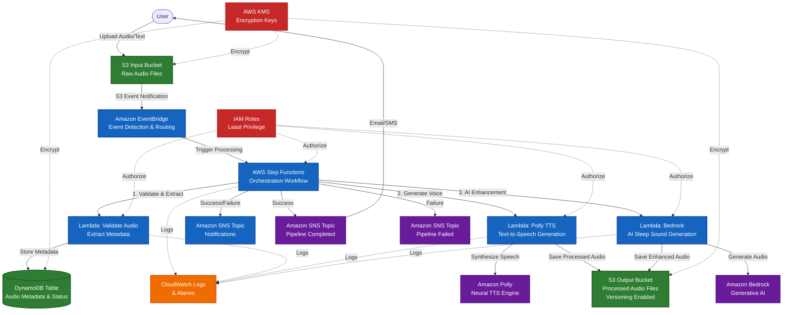
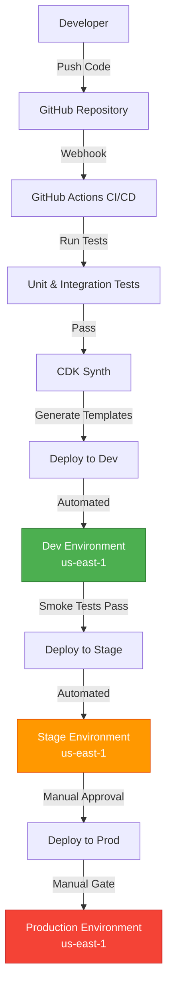

# Event-Driven Sleep Audio Pipeline Architecture

## Overview

This project implements a production-grade, event-driven sleep audio processing pipeline using AWS CDK with C# and follows Test-Driven Development (TDD) principles. The system enables users to upload raw audio files (voice recordings, ambient sounds, or text-to-speech requests) and automatically processes them through a serverless pipeline that generates soothing sleep audio content.

### Key Capabilities
- **Automated Audio Processing**: Event-driven architecture triggers processing on file upload
- **AI-Enhanced Audio**: Leverages Amazon Polly for text-to-speech and Bedrock for AI-generated soundscapes
- **Scalable & Reliable**: Serverless architecture scales automatically with demand
- **Observable**: Comprehensive logging and monitoring via CloudWatch
- **Secure**: Least-privilege IAM roles, encryption at rest, private S3 buckets
- **Multi-Environment**: Supports dev, stage, and prod environments via CDK context

---

## System Architecture Diagram
## Current Implementation Status

### ✅ Completed (Issues #3, #4, #5, #6, #7, #8, and #9)
- **Output S3 Bucket**: Private bucket with KMS encryption and versioning for processed audio files
- **KMS Key**: Customer-managed key for S3 bucket encryption with automatic key rotation
- **EventBridge Rule**: Triggers on `Object Created` events from the Input bucket, targets Step Functions state machine
- **Step Functions State Machine**: Orchestrates audio processing pipeline with CloudWatch logging enabled
- **Amazon Polly Integration**: Task state configured for text-to-speech synthesis (placeholder parameters)
- **DynamoDB Metadata Table**: Stores audio pipeline metadata with on-demand billing and point-in-time recovery
- **State Machine I/O Handling**: Integrated DynamoDB tasks for writing/updating processing status
- **SNS Notifications**: Two encrypted SNS topics for pipeline completion and failure notifications
- **Error Handling**: Step Functions Catch blocks on Lambda and Polly tasks for graceful error handling
- **Lambda Audio Processor**: Lambda function with input validation (file extensions: .mp3, .wav, .m4a, .txt, .json)
- **Complete Pipeline Wiring**: Full end-to-end integration from S3 upload through to SNS notifications
- **Input Validation**: Lambda validates file extensions; invalid files trigger the failure error path
- **Multi-Environment Support**: Environment-specific configurations for dev, stage, and prod via CDK context
- **Deployment Preparation**: CDK Pipelines skeleton and environment tagging for future CI/CD automation
- **Expanded Testing**: Comprehensive integration tests for pipeline flow, error handling, and security

### 🚧 Upcoming (Issue #10 and Beyond)
- Advanced error handling, retries, and observability (alarms, dashboards, X-Ray tracing)

These foundational components enable the event-driven architecture while following strict TDD principles with comprehensive test coverage.

---




---

## Core Infrastructure Components (Implemented)

### KMS Encryption Key
**Resource**: `AWS::KMS::Key`

A customer-managed KMS key provides encryption for all S3 buckets in the pipeline. This approach offers:
- **Key Rotation**: Automatic annual key rotation enabled
- **Audit Trail**: All key usage logged via CloudTrail
- **Fine-grained Access Control**: IAM policies control who can use the key
- **Compliance**: Meets data-at-rest encryption requirements

### Input S3 Bucket (`SleepAudioInputBucket`)
**Resource**: `AWS::S3::Bucket`

This bucket serves as the entry point for the audio processing pipeline:

**Security Features**:
- **Encryption**: KMS encryption with customer-managed key
- **Public Access**: Completely blocked (all four public access settings enabled)
- **SSL/TLS**: EnforceSSL bucket policy requires HTTPS for all operations
- **Versioning**: Enabled to protect against accidental deletions

**Event Configuration**:
- **EventBridge**: Enabled to emit S3 events to EventBridge for flexible event routing
- **Event Types**: All Object Created events (`PutObject`, `PostObject`, `CopyObject`, `CompleteMultipartUpload`)

### Output S3 Bucket (`SleepAudioOutputBucket`)
**Resource**: `AWS::S3::Bucket`

Stores processed audio files with the same security posture as the input bucket:
- KMS encryption, versioning, public access blocking, and SSL enforcement
- Ready to store outputs from Lambda processing functions

### EventBridge Rule (`S3ObjectCreatedRule`) ✅ Implemented

Captures S3 Object Created events and routes them to processing targets:
- **Event Pattern**: Matches `aws.s3` source with `Object Created` detail type
- **Bucket Filter**: Only triggers for events from the Input bucket
- **Current Target**: CloudWatch Log Group (placeholder for future Step Functions or Lambda targets)
- **Targets**: Step Functions state machine (primary) and CloudWatch Log Group (for debugging)
This rule serves as the foundation for the event-driven pipeline, decoupling event detection from processing logic.

### DynamoDB Metadata Table (`SleepAudioMetadataTable`) ✅ Implemented (Issue #5)

**Resource**: `AWS::DynamoDB::Table`

This table stores metadata and processing status for each audio file that enters the pipeline:

**Table Configuration**:
- **Partition Key**: `audioId` (String) - Unique identifier generated from S3 bucket name and object key
- **Billing Mode**: PAY_PER_REQUEST (on-demand) - Automatically scales without capacity planning
- **Encryption**: AWS-managed SSE (server-side encryption) enabled by default
- **Point-in-Time Recovery**: Enabled for data protection and backup capabilities
- **Removal Policy**: RETAIN - Table is preserved when stack is deleted

**Stored Attributes** (DynamoDB is schemaless, but typical items include):
- `audioId`: Unique identifier (e.g., "s3-bucket-name-path/to/file.mp3")
- `status`: Processing status (PROCESSING, COMPLETED, FAILED)
- `inputBucket`: Source S3 bucket name
- `inputKey`: Source S3 object key
- `outputKey`: Processed file location (populated after completion)
- `createdAt`: Timestamp when processing started
- `updatedAt`: Timestamp of last status update
- `errorDetails`: Error information (if status is FAILED)

**Access Pattern**: The state machine writes an initial record when triggered by S3 events and updates the status as processing progresses.

### SNS Topics (Notifications) ✅ Implemented (Issue #6)

**Resources**: `AWS::SNS::Topic` (2 topics)

Two SNS topics provide pipeline status notifications:

**PipelineCompletedTopic**:
- **Purpose**: Notifies subscribers when audio processing completes successfully
- **Encryption**: KMS encryption using the same customer-managed key as S3 buckets
- **Message Content**: Includes audioId, status (COMPLETED), timestamp, and success message

**PipelineFailedTopic**:
- **Purpose**: Notifies subscribers when audio processing fails
- **Encryption**: KMS encryption for secure error notifications
- **Message Content**: Includes audioId, status (FAILED), error details, and timestamp

**Security**: Both topics use the shared KMS encryption key, ensuring consistent encryption across the pipeline. Access is restricted to the state machine execution role via least-privilege IAM policies.

**Future Enhancements**: Subscription filters, email/SMS subscriptions, webhook integrations, and Lambda-based notification processors.

## Data Flow

### 1. Audio Upload & Event Detection
**Trigger**: User uploads a raw audio file (e.g., `user123/voice-recording.mp3`) or text file (e.g., `user123/bedtime-story.txt`) to the **Input S3 Bucket**.

**Event Flow**:
1. S3 emits an `s3:ObjectCreated:*` event notification
2. EventBridge rule matches the event pattern for the input bucket
3. EventBridge triggers the Step Functions state machine, passing object metadata (bucket name, object key, size, timestamp)

### 2. Processing Orchestration (Step Functions) ✅ Updated (Issue #6)
**State Machine Workflow**:

```
┌─────────────────┐
│  Start          │
└────────┬────────┘
         │
         ▼
┌──────────────────────────────┐
│ Write Initial Metadata       │  ← DynamoDB: Create record with status=PROCESSING
│ (DynamoDB PutItem)           │
│ Validate & Extract      │  ← Lambda: Check file type, extract metadata
│ Metadata                │    Store initial record in DynamoDB
└────────┬────────────────┘
         │
         ▼
    ┌────────┐
    │ Choice │  ← Branch based on input type
    └───┬────┘
        │
        ├─────► Text Input? ──► Polly TTS Generation ──┐
        │                                              │
        └─────► Audio Input? ──► Bedrock Enhancement ──┤
                                                      │
                                                      ▼
                                           ┌──────────────────────┐
                                            ┌─────────────────┐
                                            │ Update DynamoDB │
                                            │ (Success Status)│
                                            └────────┬────────┘
                                                     │
                                                     ▼
                                            ┌─────────────────┐
                                            │ Send SNS        │
                                            │ Notification    │
                                            └────────┬────────┘
                                                     │
                                                     ▼
                                                  [End]
                                                  
[Any Step Error] ──► Catch Block ──► Update DynamoDB (FAILED) ──► SNS Error Notification ──► [End]
```

**Current Implementation** (Issue #6):
The state machine now includes comprehensive error handling and notifications:

```
┌────────────────────────────────┐
│  Start (S3 Event Trigger)      │
└──────────┬─────────────────────┘
           │
           ▼
┌─────────────────────────────────────┐
│  Write Initial Metadata (DynamoDB)  │
│  - Create audioId from S3 event     │
│  - Set status = PROCESSING          │
│  - Store input bucket/key           │
│  - Record createdAt timestamp       │
└──────────┬──────────────────────────┘
┌─────────────────────────────────────┐
│  Lambda: Process Audio               │
│  - Validate S3 event details         │
│  - Log input for debugging           │
│  - Enrich metadata (placeholder)     │
│  - Return success/failure response   │
└──────────┬──────────────────────────┘
           │
           ▼
┌──────────────────────────────────┐
           ▼
┌─────────────────────────────────┐
│  Polly Text-to-Speech Task      │
│  - Neural engine (Joanna voice) │
│  - Placeholder text for now     │
│  - Output to S3 Output bucket   │
│                                 │
│  [Catch: States.ALL]            │ ──► Error Path
└──────────┬──────────────────────┘           │
           │                                   │
           ▼                                   ▼
┌────────────────────────────────────┐   ┌─────────────────────────────┐
│  Update Status to Completed        │   │  Update Status to Failed    │
│  (DynamoDB UpdateItem)             │   │  (DynamoDB UpdateItem)      │
│  - Set status = COMPLETED          │   │  - Set status = FAILED      │
│  - Update updatedAt timestamp      │   │  - Store error details      │
└──────────┬─────────────────────────┘   │  - Update updatedAt         │
           │                              └──────────┬──────────────────┘
           ▼                                         │
┌────────────────────────────────────┐              ▼
│  Publish Success Notification      │   ┌─────────────────────────────┐
│  (SNS Publish)                     │   │  Publish Failure Notification│
│  - Topic: PipelineCompleted        │   │  (SNS Publish)              │
│  - Include audioId, status         │   │  - Topic: PipelineFailed    │
│  - Timestamp                       │   │  - Include error details    │
└──────────┬─────────────────────────┘   └──────────┬──────────────────┘
           │                                         │
           ▼                                         ▼
       [End: Success]                           [End: Failed]
```


**Lambda Integration** (Issue #7):
The state machine now includes a Lambda function invocation step between the initial metadata write and Polly task:

1. **Lambda Function**: `SleepAudioProcessorFunction`
   - **Runtime**: Python 3.12
   - **Purpose**: Placeholder for audio processing, metadata enrichment, or validation logic
   - **Input**: Receives S3 event details (bucket name, object key) from the state machine
   - **Output**: Returns success/failure status with enriched metadata
   - **Environment Variables**:
     - `METADATA_TABLE_NAME`: DynamoDB table name for metadata storage
     - `OUTPUT_BUCKET_NAME`: S3 bucket name for output files

2. **IAM Permissions**:
   - **Lambda Execution Role**:
     - `dynamodb:GetItem`, `dynamodb:PutItem`, `dynamodb:UpdateItem` on MetadataTable
     - `s3:GetObject*`, `s3:GetBucket*`, `s3:List*` on Input bucket
     - `s3:PutObject*`, `s3:Abort*` on Output bucket
     - `logs:CreateLogGroup`, `logs:CreateLogStream`, `logs:PutLogEvents` for CloudWatch Logs
   - **State Machine Execution Role**:
     - `lambda:InvokeFunction` on SleepAudioProcessorFunction

3. **Future Enhancements**:
   - File format validation (MP3, WAV, M4A, or TXT)
   - Audio metadata extraction (duration, bitrate, channels)
   - DynamoDB status updates from within the Lambda function
**Error Handling Strategy**:
- **Catch Blocks**: The Polly task has a `Catch` block that catches all errors (`States.ALL`)
- **Error Path**: On error, the workflow transitions to update DynamoDB status to FAILED and publishes a failure notification
- **Error Context**: Error details are captured in the `$.error` result path and stored in DynamoDB for debugging

### 3. Processing Steps

#### Step 1: Validation & Metadata Extraction
- **Lambda Function**: `ValidateAudioFunction`
- **Actions**:
  - Validates file format (MP3, WAV, M4A, or TXT)
  - Extracts metadata: file size, duration (for audio), MIME type
  - Generates unique processing ID
  - Creates initial DynamoDB record:
    ```json
    {
      "ProcessingId": "proc-abc123",
      "UserId": "user123",
      "InputKey": "user123/voice-recording.mp3",
      "Status": "PROCESSING",
      "CreatedAt": "2024-01-15T10:30:00Z",
      "Duration": 120.5,
      "FileSize": 2048576
    }
    ```

#### Step 2: Text-to-Speech (Polly)
- **Lambda Function**: `PollyProcessingFunction`
- **Triggered When**: Input file is text (`.txt`, `.json` with text field)
- **Actions**:
  - Reads text content from input file
  - Invokes Amazon Polly with neural voice (e.g., `Joanna`, `Matthew`)
  - Applies SSML tags for soothing speech patterns (slower rate, softer volume)
  - Saves synthesized audio to Output S3 Bucket
  - Updates DynamoDB with output location and audio duration

**Example Polly Request**:
```xml
<speak>
  <prosody rate="slow" volume="soft">
    Close your eyes and imagine a peaceful forest...
  </prosody>
</speak>
```

#### Step 3: AI Enhancement (Bedrock)
- **Lambda Function**: `BedrockEnhancementFunction`
- **Triggered When**: Input file is audio or TTS output requires enhancement
- **Actions**:
  - Analyzes audio characteristics
  - Generates complementary ambient soundscapes (rain, ocean waves, white noise)
  - Mixes generated sounds with original audio
  - Applies sleep-optimized audio processing (gradual fade-out, binaural beats)
  - Saves enhanced audio to Output S3 Bucket

### 4. Output Storage & Metadata
- **Output S3 Bucket**: Stores processed files with versioning enabled
  - Path structure: `{user_id}/{processing_id}/output.mp3`
  - Metadata tags: processing_id, user_id, duration, format
- **DynamoDB Table**: Updated with final status
  ```json
  {
    "ProcessingId": "proc-abc123",
    "UserId": "user123",
    "Status": "COMPLETED",
    "OutputKey": "user123/proc-abc123/output.mp3",
    "ProcessingTimeMs": 3450,
    "CompletedAt": "2024-01-15T10:30:15Z"
  }
  ```

### 5. Notifications
- **SNS Topic**: Publishes messages on completion or failure
- **Success Notification**:
  ```json
  {
    "Subject": "Sleep Audio Processing Complete",
    "Message": "Your audio file has been processed successfully.",
    "ProcessingId": "proc-abc123",
    "OutputUrl": "https://output-bucket.s3.amazonaws.com/user123/proc-abc123/output.mp3"
  }
  ```
- **Error Notification**: Includes error details and processing ID for troubleshooting

---

## AWS Services & Architecture Decisions

### S3 Buckets (Input & Output) ✅ Implemented
**Why S3?**
- Durable, scalable object storage for audio files
- Native event notifications for event-driven architecture
- Versioning protects against accidental overwrites
- Lifecycle policies can archive old files to Glacier for cost savings

**Current Configuration**:
- **Encryption**: SSE-KMS with customer-managed keys
- **Access**: Private buckets with bucket policies (no public access)
- **Versioning**: Enabled on output bucket for audit trail
- **EventBridge**: Enabled on input bucket for event-driven processing
- **SSL Enforcement**: All bucket operations require HTTPS

**Future Enhancements**:
- CORS configuration for pre-signed URL uploads (web UI)
- S3 Lifecycle policies to transition old files to Glacier
- S3 Access Logging for security auditing

### Amazon EventBridge ✅ Implemented
**Why EventBridge over S3 Direct Lambda Trigger?**
- Decouples event source from targets (flexibility to add more consumers)
- Advanced filtering capabilities (e.g., filter by file extension, prefix)
- Built-in retry and dead-letter queue support
- Event archive for debugging and replay

**Event Pattern Example**:
```json
{
  "source": ["aws.s3"],
  "detail-type": ["Object Created"],
    "bucket": {"name": ["<input-bucket-name>"]}
    "object": {"key": [{"prefix": ""}]}
  }
}
```
**Current Status**: Rule is configured with a CloudWatch Logs target as a placeholder. Future issues will replace this with Step Functions state machine invocation.
- State management eliminates need for custom coordination logic
- Supports long-running workflows (up to 1 year)

**State Machine Type**: Standard (for complex workflows with guaranteed execution order)
**Current State Machine Workflow** (Issue #5):
The state machine now includes basic input/output handling with DynamoDB integration:

```
┌─────────────────────────────┐
│  Start                      │

[Error Handling]
Future: Add Catch blocks to update status = FAILED
```

**S3 Event to State Machine Input Mapping**:
The EventBridge rule passes the complete S3 event payload to the state machine. Key fields used by DynamoDB tasks:
- `$.detail.bucket.name` → Input bucket name
- `$.detail.object.key` → Input object key
- `$$.State.EnteredTime` → State machine execution timestamp

**IAM Permissions**:
The state machine execution role has been granted:
- `dynamodb:PutItem` - Write initial metadata record
- `dynamodb:UpdateItem` - Update processing status
- `dynamodb:GetItem` - Read metadata (for future error handling)
- `dynamodb:DeleteItem` - Cleanup operations (for future use)

These permissions are scoped to the `SleepAudioMetadataTable` resource only (least-privilege principle).

**Future Enhancements** (Issue #7+):
- Add Bedrock enhancement task for AI-generated soundscapes
- Store Polly task output location in DynamoDB

**Current Implementation** (`SleepAudioPipelineStateMachine`):
- **State Machine Type**: Standard workflow with guaranteed execution order
- **Logging**: CloudWatch Logs with ALL level logging and execution data included
- **Tracing**: AWS X-Ray tracing enabled for distributed tracing
- **IAM Permissions**: Least-privilege execution role with permissions to:
  - Invoke Amazon Polly (`polly:StartSpeechSynthesisTask`)
  - Publish to SNS topics (`sns:Publish`)
  - Update DynamoDB table (`dynamodb:PutItem`, `dynamodb:UpdateItem`)
  - Write to Output S3 bucket (`s3:PutObject`)
  - Use KMS encryption key (`kms:Decrypt`, `kms:Encrypt`, `kms:GenerateDataKey`)
  - Write logs to CloudWatch Logs

**State Machine Definition**:
The current implementation includes a minimal Polly integration task:

```
Start → Polly Text-to-Speech Task → End
```

**Polly Task Configuration**:
- **Service**: Amazon Polly `StartSpeechSynthesisTask` API
- **Engine**: Neural TTS engine for high-quality, natural-sounding voices
- **Voice**: Joanna (US English, female voice suitable for soothing content)
- **Output Format**: MP3 (widely compatible audio format)
- **Output Destination**: Output S3 bucket
- **Text**: Placeholder text (future implementation will accept input from S3 event)

**EventBridge Integration**:
The EventBridge rule now targets the state machine with:
- **Input**: Full S3 event payload passed to state machine execution
- **Retry Policy**: 2 retry attempts with maximum event age of 1 hour
- **Dead Letter Queue**: None (future enhancement for failed executions)

**Error Handling**:
- Automatic retries with exponential backoff for transient errors
- Catch blocks for graceful failure handling
- Dead-letter queue for unrecoverable errors

### AWS Lambda (Audio Processing Function) ✅ Implemented (Issue #7)

**Function**: `SleepAudioProcessorFunction`
**Runtime**: Python 3.12
**Memory**: 512 MB
**Timeout**: 5 minutes

**Purpose**:
This Lambda function serves as a placeholder for future audio processing, metadata enrichment, or validation logic. It's integrated into the Step Functions state machine as a Task step after the initial DynamoDB metadata write.

**Current Implementation**:
The function performs basic operations:
- Receives S3 event details from the Step Functions state machine
- Logs the input for debugging and observability
- Extracts bucket name and object key from the event
- Generates audio ID for tracking
- Performs basic input validation
- Returns success/failure response with metadata

**Environment Variables**:
- `METADATA_TABLE_NAME`: DynamoDB table name for metadata storage
- `OUTPUT_BUCKET_NAME`: S3 bucket name for output files

**IAM Permissions**:
- **DynamoDB**: Read/write access to MetadataTable (GetItem, PutItem, UpdateItem, DeleteItem)
- **S3**: Read access to Input bucket, write access to Output bucket
- **CloudWatch Logs**: Create log groups/streams and put log events

**Future Enhancements**:
- File format validation (MP3, WAV, M4A, or TXT)
- Audio metadata extraction using libraries like `pydub` or `mutagen`
- DynamoDB status updates directly from the Lambda
- Integration with AWS Elemental MediaConvert for audio transcoding

### AWS Lambda (Processing Functions)
**Runtime**: .NET 8 (C#) for consistency with CDK code
**Memory**: 1024 MB (adjustable per function based on workload)
**Timeout**: 5 minutes (sufficient for most audio processing tasks)

**Function Responsibilities**:
1. **ValidateAudioFunction**: Lightweight validation and metadata extraction
2. **PollyProcessingFunction**: Text-to-speech synthesis
3. **BedrockEnhancementFunction**: AI-powered audio generation and enhancement

### Amazon Polly
### Amazon Polly ✅ Minimal Integration (Issue #4)

- High-quality neural text-to-speech voices
- SSML support for fine-grained speech control
- Multiple languages and voices for personalization
- Cost-effective (pay-per-character)

**Voice Selection**: Neural voices (Joanna, Matthew) for natural, soothing narration


**Current Implementation**:
- Integrated as a Step Functions task using `CallAwsService` 
- Configured to use `StartSpeechSynthesisTask` for asynchronous synthesis
- Neural engine selected for premium voice quality
- Joanna voice selected (neutral, calming tone ideal for sleep content)
- Direct output to S3 Output bucket

**Placeholder Configuration**:
The current task uses hardcoded placeholder text. Future implementation (Issue #5+) will:
- Read input text from S3 object (based on EventBridge event payload)
- Support SSML markup for advanced speech control (prosody, pauses, emphasis)
- Allow voice selection based on user preferences
- Implement error handling for invalid text or synthesis failures
### Amazon Bedrock
**Why Bedrock?**
- Access to state-of-the-art generative AI models
- Potential for audio synthesis, sound generation, and enhancement
- Foundation model flexibility (Anthropic Claude, Stability AI, etc.)
- Serverless inference (no infrastructure management)

**Use Cases**:
- Generate ambient soundscapes (rain, ocean, forest)
- Create personalized sleep stories from prompts
- Enhance audio with binaural beats or white noise

### DynamoDB
- Access to state-of-the-art generative AI models
**Why DynamoDB?**
- Serverless, auto-scaling NoSQL database
- Low-latency reads/writes for metadata storage
- Flexible schema for evolving metadata requirements
- Integrated with Step Functions for state management

### DynamoDB ✅ Implemented (Issue #5)
- **Primary Key**: `ProcessingId` (String)
- **GSI**: `UserId-CreatedAt-index` for user-specific queries
- **Attributes**: Status, InputKey, OutputKey, Duration, FileSize, Timestamps, ErrorDetails

**Capacity Mode**: On-Demand (scales automatically without capacity planning)

- **Primary Key**: `audioId` (String) - Composite of S3 bucket name and object key

### Amazon SNS ✅ Implemented (Issue #6)
**Why SNS?**
- Pub/Sub messaging for fan-out notifications
- Pub/Sub messaging for fan-out notifications
- **Future GSI**: `UserId-CreatedAt-index` for user-specific queries (when user management is added)
- Message encryption at rest and in transit
- Dead-letter queues for undeliverable messages
- Multiple subscription types (Email, SMS, SQS, Lambda)
**Current Implementation**:
- **Two Topics**: `SleepAudioPipelineCompleted` and `SleepAudioPipelineFailed`
- **Encryption**: Both topics encrypted with the shared KMS customer-managed key
- **Integration**: Step Functions publishes notifications on success and failure paths
- **Message Format**: JSON with audioId, status, timestamp, and relevant metadata

**Success Notification Example**:
```json
{
  "status": "COMPLETED",
  "message": "Sleep audio pipeline completed successfully",
  "audioId": "s3-bucket-name-path/to/file.mp3",
  "timestamp": "2024-01-15T10:30:00Z"
}
```

- `SleepAudioProcessingTopic`: Success and error notifications

### AWS KMS ✅ Implemented
**Why Customer-Managed Keys?**
- Fine-grained control over encryption key rotation
- Audit trail of key usage via CloudTrail
- Compliance requirements for data-at-rest encryption

**Keys**:
- `SleepAudioS3Key`: Encrypts S3 objects
- `SleepAudioDynamoDBKey`: Encrypts DynamoDB data

### CloudWatch Logs & Alarms
**Observability Strategy**:
- **Logs**: All Lambda functions and Step Functions executions logged
- **Metrics**: Custom metrics for processing duration, error rates, file sizes
- **Alarms**:
  - High error rate in Step Functions (>5% failures)
  - Lambda function throttling
  - DynamoDB capacity exceeded

**Log Retention**: 30 days (configurable per environment)

---

## Security Architecture

### Principle of Least Privilege
Every AWS service and Lambda function has minimal IAM permissions:

- **Step Functions Execution Role**:
  - Publish to SNS topics (scoped to specific topic ARNs)
  - Read/Write DynamoDB table (scoped to specific table)
  - Write to S3 output bucket
  - Use KMS key for encryption/decryption
  - Publish to SNS topic
  - Write logs to CloudWatch

- **Lambda Execution Roles**:
  - **ValidateAudioFunction**: Read from input bucket, write to DynamoDB, CloudWatch Logs
  - **PollyProcessingFunction**: Read from input bucket, write to output bucket, invoke Polly, update DynamoDB
  - **BedrockEnhancementFunction**: Read from input/output buckets, write to output bucket, invoke Bedrock, update DynamoDB

### Data Encryption
- **At Rest**: All S3 objects and DynamoDB data encrypted with KMS customer-managed keys
- **In Transit**: HTTPS/TLS 1.2+ for all AWS service communication

### Network Security
- **Private S3 Buckets**: Block all public access
- **VPC Endpoints**: (Future enhancement) Lambda functions in VPC with S3/DynamoDB VPC endpoints for private communication

### Audit & Compliance
- **CloudTrail**: Logs all API calls for auditing
- **S3 Access Logging**: Tracks bucket access patterns
- **DynamoDB Point-in-Time Recovery**: Enabled for data protection

---

## Multi-Environment Support
### CDK Context Configuration ✅ Implemented (Issue #9)

### CDK Context Configuration
Environments are defined in `cdk.json` context:

```json
{
  "environments": {
    "dev": {
      "account": "111111111111",
      "region": "us-east-1",
      "bucketPrefix": "sleep-audio-dev",
      "logRetentionDays": 7
    },
    "stage": {
      "account": "222222222222",
      "region": "us-east-1",
      "bucketPrefix": "sleep-audio-stage",
      "logRetentionDays": 30
    },
    "prod": {
      "account": "333333333333",
      "region": "us-east-1",
      "bucketPrefix": "sleep-audio-prod",
      "logRetentionDays": 90,
      "enableAlarms": true
    }
  }
}
```

**Usage**:
```bash
# Deploy to development environment
cdk deploy -c environment=dev

# Synthesize staging environment template
cdk synth -c environment=stage

# Deploy to production with confirmation
cdk deploy -c environment=prod
```

### Environment-Specific Configurations ✅ Implemented (Issue #9)

The stack automatically applies environment-specific settings:

- **Dev**: Reduced log retention, no alarms, smaller Lambda memory
- **Stage**: Mirrors production configuration for testing
- **Prod**: Full alarms, longer log retention, optimized resources

**Environment Tags**:
All resources are automatically tagged with:
- `Environment`: dev/stage/prod
- `Project`: SleepAudioPipeline
- `ManagedBy`: CDK

These tags enable:
- Cost allocation and tracking by environment
- Resource organization and filtering
- Automated compliance reporting
- Environment-specific access controls

### Deployment Architecture



### CDK Pipelines Skeleton ✅ Prepared (Issue #9)

A `PipelineStack` skeleton has been created for future automated deployment:

**Structure**:
```
src/CdkBase/
├── CdkBaseStack.cs        # Main application stack
├── PipelineStack.cs       # Deployment pipeline (skeleton)
└── Program.cs             # Entry point with environment support
```

**Future Pipeline Features** (Issue #10+):
- GitHub source integration
- Automated build and test stages
- Multi-environment deployment workflow
- Manual approval for production
- Rollback capabilities
- Deployment notifications

The pipeline infrastructure is ready but not yet activated. Current deployment is manual via `cdk deploy`.

---

## Cost Considerations

### Cost Optimization Strategies
1. **S3 Lifecycle Policies**: Transition processed files to Glacier after 90 days
2. **DynamoDB On-Demand**: Pay only for actual reads/writes (avoid over-provisioning)
3. **Lambda Memory Sizing**: Right-size based on CloudWatch performance metrics
4. **Step Functions Express**: Consider Express workflows for high-throughput, short-duration workflows
5. **Polly & Bedrock Usage**: Implement client-side caching for repeated requests

### Cost Monitoring
- **AWS Cost Explorer**: Track spending by service and environment
- **Budget Alerts**: Set monthly budgets with SNS notifications at 80% threshold
- **Tagged Resources**: Tag all resources with `Environment`, `Project`, `CostCenter` for granular analysis

---

## Observability & Monitoring

### CloudWatch Dashboards
**Sleep Audio Pipeline Dashboard**:
- Step Functions execution count (success/failed)
- Lambda invocation count, duration, errors
- DynamoDB read/write capacity utilization
- S3 bucket size and request metrics

### Alarms (Production Only)
1. **HighStepFunctionsErrorRate**: Triggers when error rate >5% over 5 minutes
2. **LambdaThrottling**: Any Lambda function throttled >10 times in 5 minutes
3. **DynamoDBCapacityExceeded**: On-demand capacity throttled
4. **S3InputBucketSizeExceeded**: Bucket size >100 GB (configurable)

### Distributed Tracing (Future Enhancement)
- **AWS X-Ray**: End-to-end request tracing across Step Functions and Lambda

---

## Future Extensibility

### Planned Enhancements
1. **User Authentication**: Integrate with Amazon Cognito for user management
2. **GraphQL API**: Add AWS AppSync for real-time status updates
3. **Batch Processing**: Process multiple files in parallel with SQS and Lambda
4. **Custom Audio Effects**: Allow users to select voice styles, background sounds, and effects
5. **Machine Learning**: Train custom models for sleep quality prediction
6. **Mobile App Integration**: Native iOS/Android apps with push notifications
7. **Analytics Dashboard**: User engagement metrics and popular audio types

### Scalability Roadmap
- **Multi-Region**: Deploy to multiple AWS regions for global user base
- **CDN**: Use CloudFront for fast, cached audio delivery
- **Database Replication**: DynamoDB global tables for multi-region data access

---

## Project Structure

```
cdk-sleep-csharp-qdev/
├── src/
│   ├── CdkBase/                     # Main CDK application
│   │   ├── CdkBase.csproj          # Main project dependencies
│   │   ├── Program.cs              # CDK app entry point
│   │   ├── CdkBaseStack.cs         # Primary infrastructure stack
│   │   └── Constructs/             # Reusable CDK constructs (future)
│   │       ├── StorageConstruct.cs # S3 buckets and KMS keys
│   │       ├── ProcessingConstruct.cs # Step Functions and Lambda
│   │       └── MonitoringConstruct.cs # CloudWatch and alarms
│   ├── CdkBase.Tests/              # Test project
│   │   ├── CdkBase.Tests.csproj    # Test dependencies (xUnit, CDK Assertions)
│   │   └── CdkBaseStackTests.cs    # Stack unit tests
│   └── Lambda/                     # Lambda function code (future)
│       ├── ValidateAudio/
│       ├── PollyProcessing/
│       └── BedrockEnhancement/
├── .github/
│   └── workflows/
│       └── ci.yml                  # CI/CD pipeline
├── docs/
│   ├── ARCHITECTURE.md             # This file
│   └── AGENT_GUIDELINES.md         # Development guidelines
└── cdk.json                        # CDK configuration with context
```

---

## Technology Stack

### Core Framework
- **.NET 8.0**: Modern C# runtime with enhanced performance and features
- **AWS CDK 2.252.0**: Infrastructure as Code framework
- **Amazon.CDK.Lib**: CDK construct library

### Testing
- **xUnit 2.9.2**: Test framework for .NET

- **Amazon.CDK.Assertions**: CDK-specific assertions for infrastructure testing
- **Coverlet**: Code coverage collection


### CI/CD

- **AWS CDK CLI**: Infrastructure synthesis and deployment
This project strictly follows Test-Driven Development (TDD) principles:

1. **Red Phase** - Write failing tests first using CDK Assertions
2. **Green Phase** - Write minimal code to make tests pass
3. **Refactor Phase** - Improve code quality and documentation

All infrastructure changes are driven by tests in `src/CdkBase.Tests/CdkBaseStackTests.cs`, ensuring correctness and preventing regressions.

---

## Testing Strategy

### Unit Tests (CDK Assertions) ✅ Implemented
Tests verify infrastructure correctness using the `Amazon.CDK.Assertions` library:

**S3 Bucket Tests**:
- KMS encryption enabled with customer-managed key
- Versioning enabled for data protection
- Public access completely blocked (all four settings)
- EventBridge notifications enabled on input bucket

**KMS Key Tests**:
- Verifies KMS key resource exists

**EventBridge Rule Tests**:
- Event pattern matches S3 Object Created events
- Rule has at least one target configured
- Bucket-specific filtering

**Stack Synthesis Test**:
**Step Functions Tests** (Issue #4):
- State machine resource exists
- CloudWatch logging enabled (ALL level)
- EventBridge rule targets state machine

- Verifies CloudFormation template can be generated without errors

### Integration Tests (Future)
- End-to-end workflow testing with sample audio files
- CloudFormation stack deployment in test AWS account
- Performance and load testing

---

## CI/CD Pipeline

The GitHub Actions workflow (`.github/workflows/ci.yml`) runs on every push and pull request:

1. **Restore**: `dotnet restore` - Downloads all NuGet dependencies
2. **Build**: `dotnet build` - Compiles the C# CDK application
3. **Test**: `dotnet test` - Runs xUnit tests with CDK Assertions
4. **Synth**: `cdk synth` - Generates CloudFormation templates
5. **Diff**: `cdk diff` - Shows infrastructure changes (on PRs)

All tests must pass before code can be merged, ensuring TDD compliance.

---

## Strong Typing Guidelines

### Use Explicit Types
```csharp
// ✅ Good: Explicit and type-safe
public sealed class EventConfig
{
    public required string EventSource { get; init; }
    public required int TimeoutSeconds { get; init; }
}

// ❌ Avoid: Dynamic or object types
var config = new { EventSource = "s3", Timeout = 30 };
```

### Leverage Nullable Reference Types
```csharp
// Enable in project file: <Nullable>enable</Nullable>
public string GetBucketName() => "my-bucket";  // Never null
public string? GetOptionalConfig() => null;     // May be null
```

---

## References & Documentation

### Internal Documentation
- [AGENT_GUIDELINES.md](AGENT_GUIDELINES.md) - Development guidelines for future issues
- [README.md](../README.md) - Getting started guide

### AWS Service Documentation
- AWS CDK C# Developer Guide (Official CDK documentation)
- Amazon S3 Documentation
- AWS Step Functions Developer Guide
- Amazon Polly Documentation
- Amazon Bedrock Documentation
- Amazon DynamoDB Developer Guide
- Amazon EventBridge User Guide

---

## Conclusion

This architecture provides a solid foundation for building a production-grade, event-driven sleep audio processing pipeline. The design emphasizes:

- **Scalability**: Serverless architecture scales automatically with demand
- **Reliability**: Built-in retries, error handling, and state management
- **Security**: Encryption, least-privilege IAM, and private networking
- **Observability**: Comprehensive logging, metrics, and alarms
- **Extensibility**: Modular design enables future enhancements
- **Issue #8**: Complete - Complete pipeline wiring and input validation
- **Issue #9**: Complete - Pipeline testing, refinements, and deployment preparation
- **Test-Driven**: Every component is validated with automated tests
**Recent Enhancements (Issue #9)**:

1. **Multi-Environment Support**
   - Environment-specific configurations in `cdk.json`
   - Environment tagging for all resources
   - Support for dev, stage, and prod deployments
   - Environment-aware stack naming

2. **Deployment Preparation**
   - CDK Pipelines skeleton created (`PipelineStack`)
   - Environment context handling in Program.cs
   - CI workflow validates all environments
   - Ready for automated deployment pipeline

3. **Expanded Test Coverage**
   - Environment-specific synthesis tests
   - Complete integration tests for success and error paths
   - Status update verification throughout pipeline
   - EventBridge routing and filtering tests
   - IAM least-privilege verification
   - Encryption compliance tests

4. **Refinements**
   - Improved environment handling
   - Better resource organization with tags
   - Enhanced documentation
   - CI/CD workflow improvements

**Test Coverage Summary** (Issue #9):
- ✅ 50+ comprehensive tests covering all components
- ✅ Integration tests for complete pipeline flow
- ✅ Environment-specific configuration tests
- ✅ Security and compliance verification
- ✅ Error handling and edge case coverage

**Deployment Approach**:

Current (Manual):
```bash
# Deploy to specific environment
cdk deploy -c environment=dev
cdk deploy -c environment=stage
cdk deploy -c environment=prod
```

Future (Automated via CDK Pipelines):
```
GitHub Push → CI Tests → Dev Deploy → Stage Deploy → [Manual Approval] → Prod Deploy
```

**Environment Configurations**:

| Feature | Dev | Stage | Prod |
|---------|-----|-------|------|
| Log Retention | 7 days | 30 days | 90 days |
| Detailed Monitoring | ❌ | ✅ | ✅ |
| CloudWatch Alarms | ❌ | ❌ | ✅ |
| Manual Approval | ❌ | ❌ | ✅ |

**Next Phase**: Issue #10 will focus on advanced error handling, retries, and observability:
- Implement retry logic with exponential backoff
- Add CloudWatch alarms for production monitoring
- Create custom dashboards for pipeline visibility
- Enable AWS X-Ray distributed tracing
- Add dead-letter queues for failed events
- Implement circuit breaker patterns
- Enhanced error messages and debugging
- Performance optimization and cost analysis
- **Issue #5**: Complete - DynamoDB metadata table and basic input/output handling
- **Issue #4**: Complete - Step Functions state machine skeleton with minimal Polly integration

---

As the sleep audio pipeline evolves through TDD, we'll add event-driven components including S3 buckets, Lambda functions, EventBridge rules, and Step Functions workflows. Each component will be test-driven using CDK Assertions to ensure infrastructure correctness.
